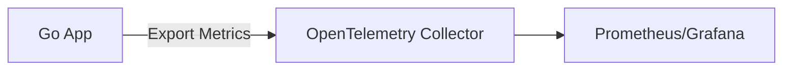

## 📄 Final `README.md` (with diagram placeholders)

````markdown
# 🛡️ Server Lord — Scalable Cron Job Monitoring System


**Server Lord** is a high-performance, scalable cron job monitoring platform that provides **real-time tracking**, **failure detection**, and **observability** for scheduled background tasks.

> ⚙ Built with **Golang**, **PostgreSQL (sharded)**, and **OpenTelemetry**  
> 🧠 Handles over **100,000 tasks** with <250ms shard-level latency

---

## 🖼️ System Architecture


> *This diagram illustrates the server, heartbeat scheduler, PostgreSQL sharding, concurrency handlers (semaphores/goroutines), and OpenTelemetry export pipeline.*

---

## 🧰 Tech Stack

| Layer         | Technology                   |
|---------------|-------------------------------|
| Backend       | Golang (Goroutines, Fiber)   |
| Database      | PostgreSQL with Citus Sharding |
| Observability | OpenTelemetry                |
| Frontend      | Next.js (optional UI layer)  |
| Architecture  | Semaphore-based concurrency  |

---

## 🚀 Features

- ✅ Multi-user heartbeat monitoring
- 🧵 Concurrency-safe tracking using semaphores
- 🔁 Push-based failure model
- 📈 Performance metrics with OpenTelemetry
- 🌐 Horizontal scalability with PostgreSQL shards

---

## 🏗️ Monitoring Workflow

```mermaid
flowchart LR
    A[Cron Job Heartbeat] --> B[Server Listener]
    B --> C{Is Heartbeat Timely?}
    C -- Yes --> D[Update Task Timestamp]
    C -- No --> E[Log Failure & Alert]
    D --> F[Metrics Exported to Telemetry]
    E --> F
````

> *This Mermaid flowchart shows how Server Lord processes incoming heartbeats from tasks and monitors their health.*

To view Mermaid diagrams on GitHub:

* Install a [browser extension like Mermaid Live Preview](https://marketplace.visualstudio.com/items?itemName=vstirbu.vscode-mermaid-preview)
* Or render externally and embed the resulting PNG

---

## 📦 Setup Instructions

### 1️⃣ Clone the Repository

```bash
git clone git@github.com:Rudranx/Server-Lord-Final.git
cd Server-Lord-Final
```

### 2️⃣ Install Dependencies

Ensure Go v1.18+ is installed:

```bash
go mod tidy
```

### 3️⃣ Configure Environment

```env
DB_HOST=localhost
DB_PORT=5432
DB_USER=your_user
DB_PASS=your_password
DB_NAME=serverlord_db
SHARD_COUNT=4
```

> Use `.env` + `godotenv` for loading environment variables.

### 4️⃣ Run the Server

```bash
go run main.go
```

---

## 🧪 Performance Testing

| Metric             | Result                                        |
| ------------------ | --------------------------------------------- |
| Users              | 10,000                                        |
| Tasks              | 100,000                                       |
| Monitoring Latency | <250ms per shard                              |
| DB Load            | Significantly reduced after push model switch |

---

## 📈 Observability with OpenTelemetry

You can visualize metrics using:



> This pipeline tracks latency, task failures, and DB timings.

---

## 🔮 Planned Enhancements

* 🔁 Dynamic monitoring intervals
* 🎯 Priority-based shard scanning
* 🧬 Experimentation with Cassandra DB
* 🤖 Remote clients for advanced automation

---

## 👨‍💻 Developed By

* **Rudransh Kumar Ankodia**
  `rudransh1896@gmail.com`

Mentored by **Adhvaith Hundi** and **Nanda Kishor Vinod** during **Sanganitra 2025**.

---

## 📜 License

This project is licensed under the [MIT License](LICENSE).

---

## 📚 References

* [Dead Man’s Snitch](https://deadmanssnitch.com/)
* [Healthchecks.io](http://healthchecks.io/)
* [PostgreSQL Sharding with Citus](https://www.citusdata.com/)
* [OpenTelemetry in Go](https://betterstack.com/community/guides/observability/opentelemetry-metrics-golang/)
* [Concurrency Patterns in Go](https://medium.com/@jamal.kaksouri/the-complete-guide-to-context-in-golang-efficient-concurrency-management-43d722f6eaea)

```
