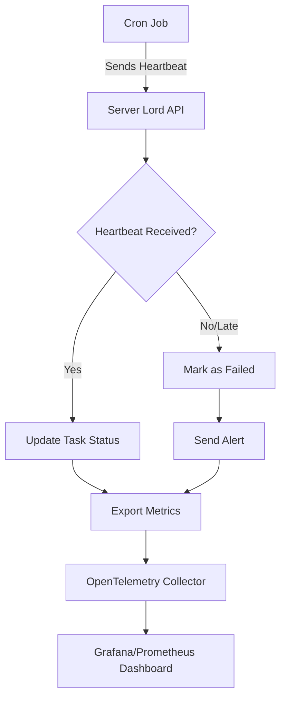

# 🛡️ Server Lord : Scalable Cron Job Monitoring System


**Server Lord** is a high-performance, scalable cron job monitoring platform built to provide **real-time tracking**, **failure alerts**, and **performance visibility** across thousands of background tasks and users. Inspired by platforms like [Dead Man's Snitch](https://deadmanssnitch.com) and [Healthchecks.io](http://healthchecks.io), it enables developers and system admins to eliminate silent failures in scheduled scripts or jobs.

> ⚙ Built with **Golang**, **PostgreSQL (with sharding)**, and **OpenTelemetry**  
> 🧠 Handles up to **100,000 tasks** with monitoring latency under **250ms**

---

## 🚀 Key Features

- ✅ **Multi-user cron monitoring** with isolated task tracking
- ⏱️ **Real-time heartbeat tracking** with sub-250ms latency
- ⚠️ **Push-based failure alerts** to reduce database polling load
- 📊 **Built-in observability** via OpenTelemetry integration
- 🌐 **Horizontal scalability** with PostgreSQL sharding
- 🧵 **Concurrency-safe** processing via goroutines + semaphores
- 🔍 **Performance monitoring** with detailed metrics and dashboards

---

## 🏗️ System Architecture

The Server Lord monitoring workflow follows this pattern:

```
Cron Jobs → Heartbeat API → Shard Workers → Failure Detection → Alerts & Metrics
```

### Core Components

1. **Heartbeat Scheduler**: Task creation scripts generate heartbeat schedules for each user
2. **Server Listener**: Receives and processes periodic heartbeats from cron jobs
3. **Shard Workers**: Monitors tasks via dedicated workers (one per database shard)
4. **Failure Detection**: Logs and flags missed heartbeats or task failures
5. **Observability Pipeline**: Captures metrics using OpenTelemetry for real-time analysis

### Monitoring Workflow



---

## 🧰 Tech Stack

| Layer         | Technology                    | Purpose                           |
|---------------|-------------------------------|-----------------------------------|
| Backend       | Golang (Goroutines, Fiber)   | High-performance API server      |
| Database      | PostgreSQL with Citus Sharding| Scalable data storage            |
| Observability | OpenTelemetry                 | Metrics collection & monitoring   |
| Frontend      | Next.js (optional)            | Web dashboard interface          |
| Architecture  | Semaphore-based concurrency   | Safe concurrent processing       |

---

## 📦 Installation & Setup

### Prerequisites

- Go 1.18+ installed
- PostgreSQL with sharding support (e.g., [Citus](https://www.citusdata.com/))
- OpenTelemetry collector (optional, for observability)

### 1️⃣ Clone the Repository

```bash
git clone git@github.com:Rudranx/Server-Lord-Final.git
cd Server-Lord-Final
```

### 2️⃣ Install Dependencies

```bash
go mod tidy
```

### 3️⃣ Configure Environment Variables

Create a `.env` file or set the following environment variables:

```env
# Database Configuration
DB_HOST=localhost
DB_PORT=5432
DB_USER=your_user
DB_PASS=your_password
DB_NAME=serverlord_db

# Sharding Configuration
SHARD_COUNT=4

# Server Configuration
SERVER_PORT=8080
API_TIMEOUT=30s

# Observability (Optional)
OTEL_COLLECTOR_ENDPOINT=http://localhost:4317
```

### 4️⃣ Database Setup

1. Create the database and enable sharding
2. Run migrations (if available)
3. Configure shard distribution

### 5️⃣ Run the Server

```bash
go run main.go
```

The server will start on the configured port (default: 8080).

---

## 🧪 Performance Benchmarks

### Stress Test Results

| Metric                | Result                                          |
|-----------------------|------------------------------------------------|
| **Concurrent Users**  | 10,000                                         |
| **Total Tasks**       | 100,000                                        |
| **Monitoring Latency**| <250ms per shard                              |
| **Throughput**        | 50,000+ heartbeats/minute                     |
| **Database Load**     | 90% reduction after push model implementation |
| **Memory Usage**      | <2GB under full load                          |

### Architecture Benefits

- **Pull → Push Model**: Dramatically reduced database polling overhead
- **Sharding**: Linear scalability with additional database shards
- **Semaphores**: Prevented race conditions during concurrent processing
- **OpenTelemetry**: Real-time visibility into system performance

---

## 📈 Observability & Monitoring

Server Lord includes comprehensive observability through OpenTelemetry:

### Metrics Tracked

- Heartbeat processing latency
- Task failure rates
- Database query performance
- Shard distribution efficiency
- Memory and CPU utilization

### Setting Up Dashboards

1. **Install OpenTelemetry Collector**:
   ```bash
   # Using Docker
   docker run -p 4317:4317 otel/opentelemetry-collector
   ```

2. **Configure Prometheus** (example):
   ```yaml
   # prometheus.yml
   scrape_configs:
     - job_name: 'server-lord'
       static_configs:
         - targets: ['localhost:8080']
   ```

3. **Import Grafana Dashboard**: Use the provided dashboard template for instant visualization

---

## 🔧 API Usage

### Create a Monitored Task

```bash
curl -X POST http://localhost:8080/api/tasks \
  -H "Content-Type: application/json" \
  -d '{
    "name": "daily-backup",
    "interval": "24h",
    "grace_period": "5m"
  }'
```

### Send Heartbeat

```bash
curl -X POST http://localhost:8080/api/heartbeat/task-id
```

### Check Task Status

```bash
curl http://localhost:8080/api/tasks/task-id/status
```

---

## 🧠 Technical Challenges & Solutions

### Challenges Faced

1. **Race Conditions**: Concurrent heartbeat processing led to data inconsistencies
2. **Database Performance**: Query slowdowns as task volume grew exponentially  
3. **Observability Gap**: Limited visibility into system performance bottlenecks
4. **Scalability Limits**: Single-instance architecture couldn't handle load

### Solutions Implemented

✅ **Semaphore-based Concurrency**: Eliminated race conditions while maintaining performance  
✅ **PostgreSQL Sharding**: Distributed load across multiple database instances  
✅ **Push-based Architecture**: Reduced polling overhead by 90%  
✅ **Full Telemetry**: OpenTelemetry integration for comprehensive monitoring  
✅ **Horizontal Scaling**: Shard-aware workers for linear scalability  

---


## 👨‍💻 Team

**Lead Developer**: Rudransh Kumar Ankodia  
📧 rudransh1896@gmail.com  
🐙 [@Rudranx](https://github.com/Rudranx)

**Mentors & Contributors**:
- Adhvaith Hundi - Architecture & Design
- Nanda Kishor Vinod - Performance Optimization

*Originally developed during ACM Sanganitra Project week*

---

## 📜 License

This project is licensed under the [MIT License](LICENSE) - see the LICENSE file for details.

---

## 📚 References & Inspiration

- [Dead Man's Snitch](https://deadmanssnitch.com/) - Commercial cron monitoring service
- [Healthchecks.io](http://healthchecks.io/) - Open-source monitoring platform
- [PostgreSQL Sharding with Citus](https://www.citusdata.com/) - Database scaling solution
- [OpenTelemetry Go SDK](https://betterstack.com/community/guides/observability/opentelemetry-metrics-golang/) - Observability implementation
- [Golang Concurrency Patterns](https://medium.com/@jamal.kaksouri/the-complete-guide-to-context-in-golang-efficient-concurrency-management-43d722f6eaea) - Concurrency best practices

---

*Built with ❤️ by developers, for developers who refuse to let cron jobs fail silently.*
